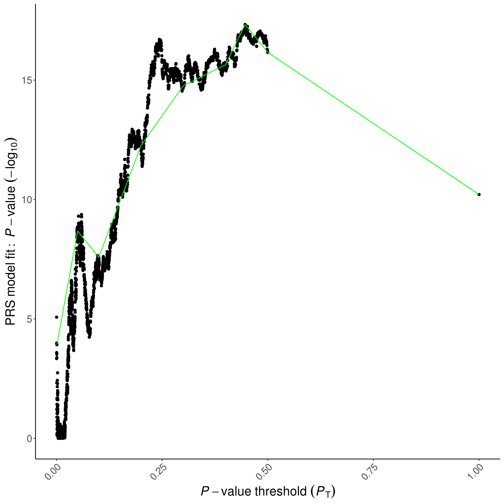

# PRSice

## PRSice參考資料
https://github.com/choishingwan/PRSice/wiki/step-by-step-tutorial

https://github.com/choishingwan/PRSice/wiki/Running-PRSice

http://prsice.info/

## Windows

1. 下載[PRSice for Windows](https://github.com/choishingwan/PRSice/releases/download/2.1.0.beta/PRSice_win64.zip)
2. 解壓縮到C槽的PRSice資料夾
3. 設定環境變數，對著**我的電腦**或**本機**按右鍵，選擇**內容**，點選左邊**進階系統設定**，選擇下方**環境變數**，在PATH中，新增Rscrpit.exe的位置。以我的電腦為例，是`C:\Program Files\Microsoft\R Open\R-3.4.0\bin`，普通的R應該是`C:\Program Files\R\R-3.3.2\bin`，版本碼跟位置因電腦而異
4. 打開cmd，輸入以下指令
```
cd c:/PRSice
Rscript PRSice.R --dir . --prsice PRSice_win64.exe --base TOY_BASE_GWAS.assoc --target TOY_TARGET_DATA
```
5.到 c:/PRSice找跑出來的結果

## Linux

### PRSice安裝
1. 連上VPN (說明請看[實驗室網路介紹](https://github.com/DHLab-CGU/Resources-Private/blob/master/Network.md)，需登入)
2. download PuTTY並打開，連上伺服器
3. IP: 192.168.1.5 (SSH)
4. login
5. 在linux主機上download PRSice，指令如下

```
wget https://github.com/choishingwan/PRSice/releases/download/2.1.0.beta/PRSice_linux.zip
unzip PRSice_linux.zip -d PRSice
cd PRSice
```
### PRSice使用
PRSice first try

```
Rscript PRSice.R --dir . --prsice PRSice_linux --base TOY_BASE_GWAS.assoc --target TOY_TARGET_DATA
```

7. Download the figure

- 安裝WinSCP
  - 點選"Installation Package"下載WinSCP英文版 https://winscp.net/eng/download.php
  - 找到"Traditional Chinese"並點選"Download"下載語言檔 https://winscp.net/eng/translations.php
  - 安裝WinSCP，按照預設選項安裝即可
  - 解壓縮語言檔（ZIP檔）
  - 將解壓縮的語言檔（WinSCP.ch）放至與WinSCP執行檔相同的目錄下
  - 執行該目錄下的WinSCP.exe檔就能開始使用
  - 如果還是語言還是英文的話在環境設定中點選"Languages"，再選取繁體中文即可完成語言設定

- 打開WinSCP
  - IP: 192.168.1.5
  - login
  
- 點選右側工作區PRSice資料夾
- 將所需檔案拉到左邊相對應本機端
  - PRSice.region
  - PRSice.summary
  - PRSice_BARPLOT_2018-01-25.png
  - PRSice_HIGH-RES_PLOT_2018-01-25.png



